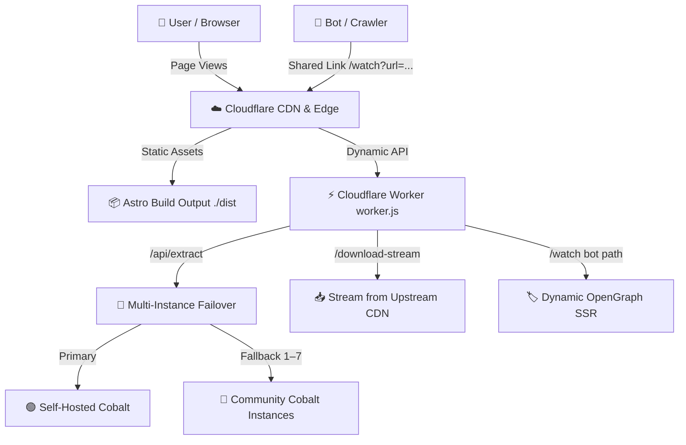

<p align="center">
  
</p>

<h1 align="center">mp4yt</h1>

<p align="center">
  <strong>Free, open-source video &amp; audio downloader for 1000+ platforms.</strong><br/>
  Download YouTube, TikTok, Instagram, Twitter/X, Reddit, and more — in 4K, HD, or MP3.<br/>
  Zero tracking. Zero storage. Direct CDN streams.
</p>

<p align="center">
  <a href="https://mp4yt.com"></a>
  <a href="https://astro.build"></a>
  <a href="https://workers.cloudflare.com"></a>
  <a href="https://tailwindcss.com"></a>
</p>

<p align="center">
  
  
  
  
</p>

---

## 🌐 What is mp4yt?

**mp4yt.com** is a high-performance, open-source web application that lets you download videos and extract audio (MP3) from **1000+ social platforms** — including YouTube, TikTok, Instagram, Twitter/X, Reddit, Soundcloud, Twitch, Vimeo, Pinterest, LinkedIn, Dailymotion, and many more.

Built with **Astro v6**, **Tailwind CSS v4**, and a blazing-fast **Cloudflare Workers** edge backend, the platform delivers direct, safe, and lightning-fast media streams from CDNs straight to your device — with **zero intermediate storage** and **zero user tracking**.

---

## ✨ Features

| Feature | Description |
| :--- | :--- |
| **🚀 1000+ Supported Sites** | YouTube, TikTok (no watermark), Instagram Reels, Twitter/X, Reddit, Twitch Clips, Soundcloud, Vimeo, Pinterest, LinkedIn, Dailymotion, Facebook, and hundreds more. |
| **⚡ Multi-Instance Failover** | Dynamically routes across 8+ Cobalt downloader instances. If one goes down, the next picks up automatically — near 100% uptime. |
| **🎥 144p → 4K + MP3** | Offers downloads from 144p, 240p, 360p, 480p, 720p, 1080p, 1440p (2K), 2160p (4K), plus high-fidelity MP3 audio extraction. |
| **🛡️ CORS-Bypassing Proxy** | Edge-proxied `/download-stream` endpoint handles CORS and injects `Content-Disposition` headers so files download directly — works on iPhone, Android, and PC. |
| **🤖 Smart SEO / Link Previews** | `/watch` endpoint detects 30+ bots (Twitterbot, Discordbot, Googlebot, TelegramBot, etc.) and serves dynamic OpenGraph + Twitter Card metadata with real thumbnails and titles. Human visitors get seamlessly redirected. |
| **🔌 Keep-Alive Cron** | A serverless Cron Trigger pings all Cobalt endpoints every 5 minutes to keep backend services warm and monitor latency. |
| **💎 Premium UI** | Vercel-inspired design — dark/light theme with FOUC prevention, glassmorphic cards, smooth micro-animations, monospaced tech accents, and fluid responsive typography. |
| **📱 PWA Support** | Offline caching, app manifest, and Service Worker (`sw.js`) — installable on Android, iOS, and Desktop. |
| **📊 Google Analytics** | Integrated GA4 tracking (`G-LNH5RT5R2G`) for traffic insights. |
| **🔍 SEO Optimized** | Dedicated landing pages for each platform, JSON-LD structured data, sitemap.xml, robots.txt, and keyword-rich meta tags. |

---

## 🎯 Supported Platforms

<table>
<tr>
  <td align="center"><strong>YouTube</strong></td>
  <td align="center"><strong>TikTok</strong></td>
  <td align="center"><strong>Instagram</strong></td>
  <td align="center"><strong>Twitter / X</strong></td>
  <td align="center"><strong>Reddit</strong></td>
  <td align="center"><strong>Facebook</strong></td>
</tr>
<tr>
  <td align="center"><strong>Twitch</strong></td>
  <td align="center"><strong>Soundcloud</strong></td>
  <td align="center"><strong>Vimeo</strong></td>
  <td align="center"><strong>Pinterest</strong></td>
  <td align="center"><strong>LinkedIn</strong></td>
  <td align="center"><strong>Dailymotion</strong></td>
</tr>
<tr>
  <td align="center" colspan="6"><em>...and 1000+ more via the Cobalt extraction engine</em></td>
</tr>
</table>

Each major platform has a **dedicated SEO landing page** (e.g., `/tiktok`, `/instagram`, `/twitter`) optimized for search engine rankings.

---

## 🏗️ Architecture

The application cleanly separates concerns between a static Astro frontend and a high-performance Cloudflare Workers edge backend.



### How It Works

1. **User pastes a URL** → The frontend sends a `GET /api/extract?url=...` request to the Worker.
2. **Worker tries Cobalt instances** → Starting with the primary self-hosted instance, falling back across 7+ community servers until one succeeds.
3. **Parallel quality extraction** → All quality variants (144p–4K + MP3) are fetched concurrently for maximum speed.
4. **Metadata scraping** → The Worker simultaneously scrapes the source page for title, thumbnail, and description.
5. **User picks a format** → The frontend displays available formats; user clicks download.
6. **Edge-proxied stream** → `/download-stream` proxies the CDN stream through Cloudflare, injecting proper headers for direct file download on any device.

---

## 🛠️ Tech Stack

| Layer | Technology | Purpose |
| :--- | :--- | :--- |
| **Frontend Framework** | [Astro v6](https://astro.build) | Static Site Generation (SSG) — pre-compiled, zero-JS-by-default pages |
| **Styling** | [Tailwind CSS v4](https://tailwindcss.com) | Utility-first CSS with fluid responsive design |
| **Edge Backend** | [Cloudflare Workers](https://workers.cloudflare.com) | Serverless API routing, proxy streaming, SEO bot handling |
| **Download Engine** | [Cobalt](https://cobalt.tools) | Open-source media extraction from 1000+ platforms |
| **Deployment** | [Wrangler CLI](https://developers.cloudflare.com/workers/wrangler/) | Build, upload assets, deploy Worker + Cron Triggers |
| **Analytics** | Google Analytics 4 | Traffic and user engagement tracking |
| **PWA** | Service Worker + Web Manifest | Offline support and installability |

---

## 📂 Project Structure

```
mp4yt/
├── public/                          # Static assets served directly
│   ├── favicon.svg                  # SVG favicon
│   ├── favicon.ico                  # ICO fallback
│   ├── favicon-96x96.png            # PNG favicon
│   ├── apple-touch-icon.png         # iOS home screen icon
│   ├── web-app-manifest-192x192.png # PWA icon (192px)
│   ├── web-app-manifest-512x512.png # PWA icon (512px)
│   ├── og-default.png               # Default OpenGraph social preview image
│   ├── site.webmanifest             # PWA manifest
│   ├── sitemap.xml                  # SEO sitemap
│   ├── robots.txt                   # Crawler rules
│   └── sw.js                        # Service Worker for offline caching
│
├── src/
│   ├── assets/                      # SVG graphics and vector assets
│   ├── layouts/
│   │   └── Layout.astro             # Base HTML shell — GA, SEO, PWA, theme FOUC
│   ├── components/
│   │   ├── Navbar.astro             # Sticky header with dark/light toggle
│   │   ├── Hero.astro               # Main URL input + download engine (39KB of UI logic)
│   │   ├── PlatformHero.astro       # Platform-specific hero variant
│   │   ├── PlatformSwitcher.astro   # Visual platform selection carousel
│   │   ├── SupportedSites.astro     # Grid of supported platform cards
│   │   ├── Features.astro           # Feature highlight cards
│   │   ├── HowItWorks.astro         # Step-by-step usage guide
│   │   ├── SEOContent.astro         # Long-form SEO content section
│   │   ├── FAQ.astro                # Accordion FAQ section
│   │   ├── Footer.astro             # Site footer with links
│   │   └── Welcome.astro            # Welcome/intro section
│   ├── pages/
│   │   ├── index.astro              # Homepage
│   │   ├── 404.astro                # Custom 404 error page
│   │   ├── 500.astro                # Custom 500 error page
│   │   ├── about-us.astro           # About page
│   │   ├── contact-us.astro         # Contact page
│   │   ├── privacy-policy.astro     # Privacy policy
│   │   ├── terms-and-conditions.astro # Terms of service
│   │   ├── dmca.astro               # DMCA takedown request page
│   │   ├── youtube.astro → index    # YouTube-specific SEO landing
│   │   ├── tiktok.astro             # TikTok-specific SEO landing
│   │   ├── instagram.astro          # Instagram-specific SEO landing
│   │   ├── twitter.astro            # Twitter/X-specific SEO landing
│   │   ├── facebook.astro           # Facebook-specific SEO landing
│   │   ├── reddit.astro             # Reddit-specific SEO landing
│   │   ├── twitch.astro             # Twitch-specific SEO landing
│   │   ├── soundcloud.astro         # Soundcloud-specific SEO landing
│   │   ├── vimeo.astro              # Vimeo-specific SEO landing
│   │   ├── pinterest.astro          # Pinterest-specific SEO landing
│   │   ├── linkedin.astro           # LinkedIn-specific SEO landing
│   │   └── dailymotion.astro        # Dailymotion-specific SEO landing
│   └── styles/
│       └── global.css               # Tailwind v4 base + custom theme styles
│
├── worker.js                        # Cloudflare Worker — API, proxy, SEO, cron (585 lines)
├── wrangler.toml                    # Cloudflare Workers deployment config
├── astro.config.mjs                 # Astro config with Tailwind plugin + dev proxies
├── package.json                     # Dependencies and scripts
└── tsconfig.json                    # TypeScript configuration
```

---

## ⚙️ Environment Variables

Configured in `wrangler.toml` (local dev) or via the Cloudflare dashboard (production):

| Variable | Type | Description |
| :--- | :--- | :--- |
| `COBALT_API_URL` | `string` | URL of the primary self-hosted Cobalt API instance |
| `COBALT_FALLBACK_INSTANCES` | `string` | Comma-separated list of fallback Cobalt instance URLs |

The Worker also includes a hardcoded list of 7 community Cobalt instances (sourced from [cobalt.directory](https://cobalt.directory/)) as a final fallback layer.

---

## 💻 Getting Started

### Prerequisites

- [Node.js](https://nodejs.org/) **v22.12.0+**
- [npm](https://www.npmjs.com/) (included with Node.js)
- [Wrangler CLI](https://developers.cloudflare.com/workers/wrangler/) (`npm install -g wrangler`) — for Worker development/deployment

### Installation

```bash
git clone https://github.com/nitin2122/mp4yt.git
cd mp4yt
npm install
```

### Development

| Command | Description |
| :--- | :--- |
| `npm run dev` | Start Astro dev server at `http://localhost:4321` |
| `npm run dev:worker` | Start Cloudflare Worker dev server at `http://localhost:8787` |
| `npm run dev:full` | Run both concurrently (frontend + Worker backend) |
| `npm run build` | Build static assets to `./dist` |
| `npm run deploy` | Build + deploy to Cloudflare Workers |

> **Tip:** During development, Astro's dev server proxies `/api/*`, `/download-stream`, and `/watch` to the Worker dev server automatically via `astro.config.mjs`.

---

## 🚀 Deployment

This project deploys as a **unified Cloudflare Workers application** — the static Astro site and the Worker backend run together on Cloudflare's edge network.

```bash
# 1. Login to Cloudflare
npx wrangler login

# 2. Build and deploy
npm run deploy
```

Wrangler will:
1. Run `npm run build` to compile the Astro site into `dist/`
2. Upload static assets to Cloudflare's edge
3. Deploy `worker.js` with the `ASSETS` binding
4. Configure the `*/5 * * * *` cron trigger for keep-alive pings

**Live deployment:** [`https://mp4yt.nitinjangir2211.workers.dev`](https://mp4yt.nitinjangir2211.workers.dev)

---

## 🔑 API Endpoints

| Endpoint | Method | Description |
| :--- | :--- | :--- |
| `/api/extract?url=<URL>` | `GET` | Extract download links for all available qualities (144p–4K + MP3) from the given URL |
| `/download-stream?url=<CDN_URL>&filename=<name>` | `GET` | Proxy-stream a media file through Cloudflare edge with proper download headers |
| `/watch?url=<URL>` | `GET` | SEO endpoint — serves OpenGraph metadata to bots, redirects humans to the app |

---

## 📡 Worker Endpoints Detail

### `/api/extract`
- Validates the input URL against private/internal network patterns
- Fires parallel requests across all quality tiers (144p–4K + audio)
- Uses multi-instance Cobalt failover (primary → env fallbacks → hardcoded community)
- Scrapes source page metadata (title, thumbnail, description) concurrently
- Returns deduplicated format list with stream URLs

### `/download-stream`
- Proxies upstream CDN responses through Cloudflare
- Injects `Content-Disposition: attachment` for direct downloads
- Supports HTTP Range requests for resumable downloads
- Sanitizes filenames for cross-platform compatibility

### `/watch`
- Detects 30+ bot user agents via regex
- For bots: Renders full OpenGraph + Twitter Card HTML with real video metadata
- For humans: 302 redirects to `/#url=<encoded_url>` for instant app loading

---

## 📜 License & Disclaimer

This project is built for **educational and demonstration purposes**. The download engine is powered by [Cobalt](https://cobalt.tools).

Users are responsible for complying with the terms of service of the respective platforms they extract media from. The authors do not host, store, or distribute any copyrighted content.

---

<p align="center">
  Made with ❤️ by <a href="https://github.com/nitin2122">Nitin Jangir</a>
</p>
